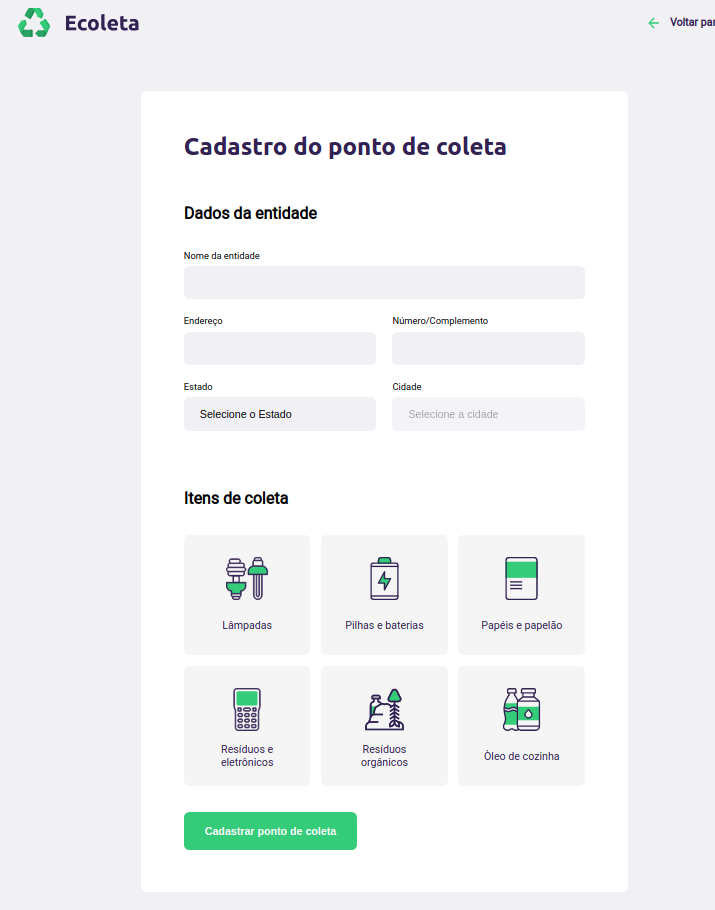
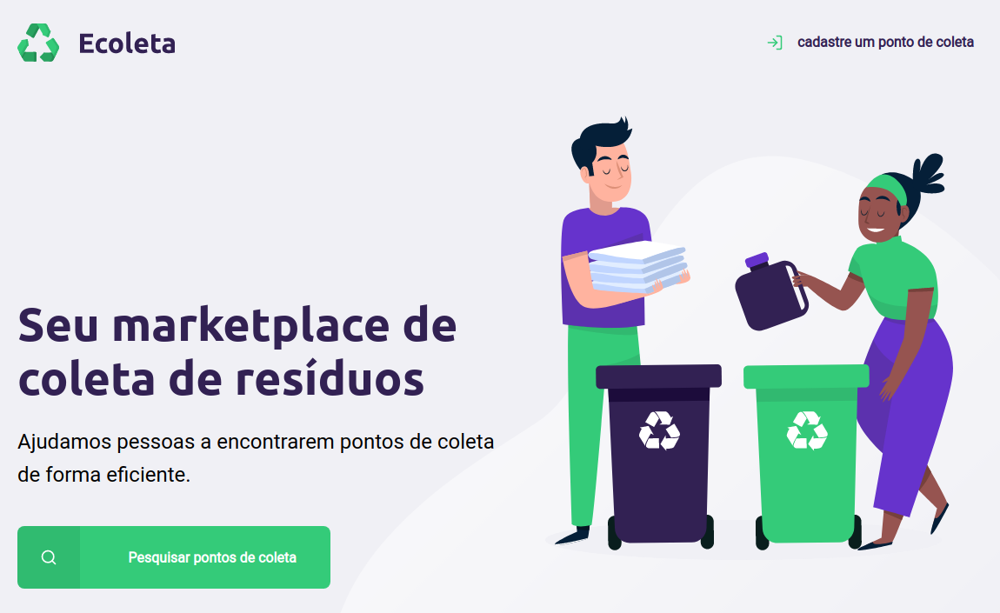
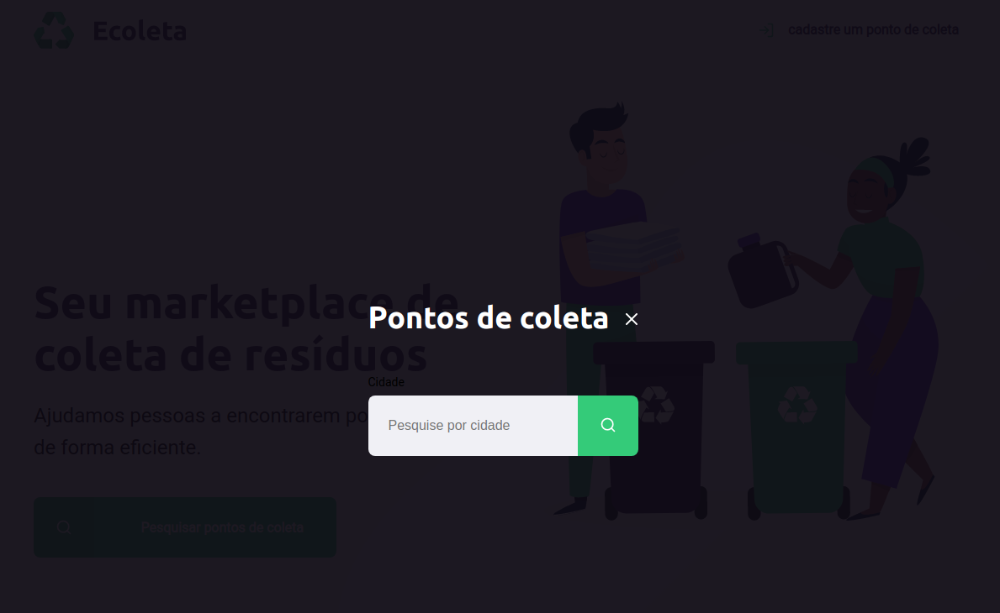

<h1 align="center">
    
</h1>

## Prints das telas desenvolvidas

<h1>
    
</h1>

<h1>
    
</h1>

<h1>
    
</h1>

## 🔖 Sobre

O projeto **Ecoleta** é um é um marketplace de coleta de resíduos, que foi criado durante a semana **Next Week Level** com o intuito de introdução ao desenvolvimento web, abordando principais assuntos do desenvolvimento web.

Aplicação web construída na trilha <strong>Starter</strong> da <strong>Next Level Week</strong> distribuída pela [Rocketseat](https://rocketseat.com.br/).

---

# [I][n][d][i][c][e]

- [Sobre](#-sobre)
- [Tecnologias Utilizadas](#-tecnologias-utilizadas)
- [Como baixar o projeto](#-como-baixar-o-projeto)

## 🔖 Sobre

O projeto **Ecoleta** é um site que foi criado na semana **Next Week Level** com o intuito de introdução ao desenvolvimento web.

---

## 🚀 Tecnologias utilizadas

O projeto foi desenvolvido utilizando as seguintes tecnologias

- [CSS](https://developer.mozilla.org/pt-BR/docs/Web/CSS)
- [HTML](https://developer.mozilla.org/pt-BR/docs/Web/HTML)
- [JavaScript](https://developer.mozilla.org/pt-BR/docs/Aprender/JavaScript)
- [NUNJUCKS](https://mozilla.github.io/nunjucks/)

---

## 🎓 Quem ministrou?

As aulas foram ministradas pelo **[Mayk Brito](https://github.com/maykbrito)** nas aulas da **Next Level Week**.


## 🗂 Como baixar o projeto

```bash

    # Clonar o repositório
    $ git clone https://github.com/CleytonPinheiro/ecoleta

    # Entrar no diretório
    $ cd ecoleta
    
    #Subir o servidor local, digitando o comando:
    $ npm start

    # Iniciar o projeto
    $ abrir no navegador: localhost:3000
```

---

